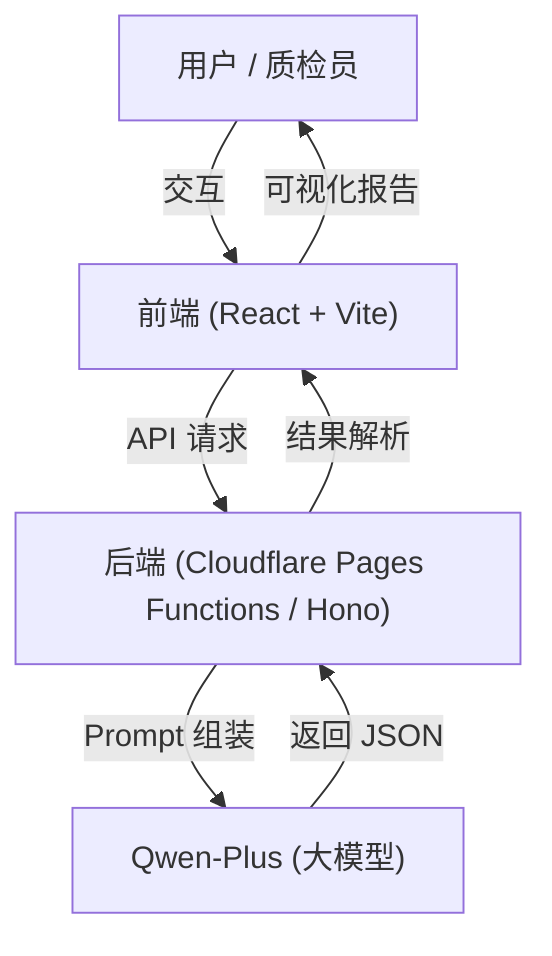

<div align="center">

# GovInsight-AI 工单办理质量智能检测系统

**Intelligent Quality Inspection System for Work Order Handling**

[](CHANGELOG.md)
[](https://www.gnu.org/licenses/gpl-3.0)


[简体中文](#简体中文) | [English](#english-introduction)

</div>

---

<a name="简体中文"></a>

**GovInsight-AI** 是一个基于 **大语言模型 (LLM)** 的政务热线工单质量检测系统。它专注于解决政务热线（如 12345）中**“群众诉求”**与**“办理答复”**的一致性与质量校验痛点。

通过引入 Qwen-Plus 大模型，系统能够像资深质检员一样，自动比对群众的原始诉求与职能部门的办理回复，精准识别**答非所问、逻辑不通、解决不彻底、态度生硬**等问题，并提供智能化的修正建议。

## 📖 项目背景与痛点

在政务服务热线的考核中，**办理回复质量**是核心指标。然而，传统的人工质检模式面临巨大挑战：

*   **⚡️ 效率低下**：海量工单依赖人工抽检，覆盖率低，大量“神回复”、“雷人回复”流出。
*   **📏 标准不一**：对“答非所问”的判定主观性强，难以统一尺度。
*   **🙈 避重就轻**：办理部门往往只回复容易解决的部分，回避群众的核心痛点（如只修绿化不查噪音）。
*   **😡 态度风险**：部分回复暗含推诿、教训语气，极易引发次生舆情。

**GovInsight-AI** 将 LLM 的语义理解能力引入质检环节，实现对**回复内容**的全量、实时、客观智能检测。

## ✨ 核心价值与功能

### 1. 🔍 多维度智能质检 (5大核心维度)
系统基于以下五个核心维度对工单进行深度扫描（总分 100 分）：
*   **答非所问 (Relevance)**：**（核心指标）** 精准识别回复是否回避核心诉求，是否推诿扯皮。
*   **回复逻辑性 (Logic)**：评估语言通顺度、逻辑连贯性及因果关系。
*   **问题解决情况 (Solution)**：判断问题是否实质性解决，群众是否认可。
*   **办理时效 (Timeliness)**：结合业务类型（咨询/非咨询）评估办理时长。
*   **回复态度 (Attitude)**：检测服务态度、语气是否友好，是否有人文关怀。

### 2. 🛡️ 智能风险防控
*   **错别字检测**：自动识别同音字、形近字及常见错误（如“按排”）。
*   **敏感词过滤**：检测是否包含“没事找事”、“瞎投诉”等不文明用语或负面词汇。
*   **强制复核机制**：对低分、低置信度或含风险词的工单，自动标记为“强制人工复核”。

### 3. 🧠 可解释的 AI 思维链 (CoT)
系统展示完整的推理过程：
> *"群众诉求核心是‘烧烤店噪音扰民’，但回复内容仅提及‘绿化修剪’，完全未涉及噪音查处，属于严重跑题..."*

### 4. ✨ 智能辅助优化
针对质量不佳的回复，AI 会自动生成**建议回复内容**，供办理人员参考，提升服务水平。

## 📸 功能演示

### 场景一：标准高分案例 (Standard High Score)
**案例背景**：市民反映路灯损坏，部门回复已核实并更换灯泡，恢复照明。
**AI 研判结果**：
*   **得分**：100 分（优秀）
*   **处置**：高置信度 -> **自动采信**。

### 场景二：严重答非所问 (Irrelevant Reply)
**案例背景**：市民投诉**烧烤店噪音扰民**，街道办回复**“已修剪绿化带”**。
**AI 研判结果**：
*   **得分**：35 分（不合格）
*   **处置**：**退回重写**。
*   **警示**：回复严重跑题，完全未解决核心诉求。

### 场景三：态度恶劣/敏感词 (Bad Attitude)
**案例背景**：回复中出现“不要没事找事”、“瞎投诉”等字眼。
**AI 研判结果**：
*   **得分**：50 分（不合格）
*   **处置**：**强制人工复核**。
*   **风险**：触发敏感词拦截，建议严肃追责。

## 🏗️ 系统架构

本项目已重构为 **Cloudflare Pages** 全栈架构，实现了 Serverless 部署。



## 🛠️ 技术栈

*   **前端**: React 19, TypeScript, Tailwind CSS 4, Lucide Icons, Vite
*   **后端**: Cloudflare Pages Functions, Hono Framework
*   **AI 模型**: Qwen-Plus (via Aliyun DashScope)
*   **部署**: Cloudflare Workers / Pages

## 🚀 快速开始

### 1. 环境准备
*   Node.js (v18+)
*   npm

### 2. 安装依赖
```bash
cd web
npm install
```

### 3. 配置环境变量
在 `web` 目录下创建 `.dev.vars` 文件：
```ini
QWEN_API_KEY=your_api_key_here
QWEN_BASE_URL=https://dashscope.aliyuncs.com/compatible-mode/v1
QWEN_MODEL_NAME=qwen-plus-2025-12-01
```

### 4. 启动本地开发
```bash
npm run dev
```
访问 `http://localhost:5173` 即可使用。

## 📄 许可证

本项目采用 [GNU GPL v3.0](LICENSE) 许可证。

---

<div align="center">
Copyright © 2025 Huotao. All Rights Reserved.
</div>
