<div align="center">

# GovInsight-AI 工单办理质量智能检测系统

**Intelligent Quality Inspection System for Work Order Handling**

[](CHANGELOG.md)
[](https://www.gnu.org/licenses/gpl-3.0)


[简体中文](#简体中文) | [English](#english-introduction)

</div>

---

<a name="简体中文"></a>

**GovInsight-AI** 是一个基于 **大语言模型 (LLM)** 的政务热线工单质量检测系统。它专注于解决政务热线（如 12345）中**“群众诉求”**与**“办理答复”**的一致性与质量校验痛点。

通过引入 Qwen-Plus 大模型，系统能够像资深质检员一样，自动比对群众的原始诉求与职能部门的办理回复，精准识别**答非所问、逻辑不通、解决不彻底、态度生硬**等问题，并提供智能化的修正建议。

## 📖 项目背景与痛点

在政务服务热线的考核中，**办理回复质量**是核心指标。然而，传统的人工质检模式面临巨大挑战：

*   **⚡️ 效率低下**：海量工单依赖人工抽检，覆盖率低，大量“神回复”、“雷人回复”流出。
*   **📏 标准不一**：对“答非所问”的判定主观性强，难以统一尺度。
*   **🙈 避重就轻**：办理部门往往只回复容易解决的部分，回避群众的核心痛点（如只修绿化不查噪音）。
*   **😡 态度风险**：部分回复暗含推诿、教训语气，极易引发次生舆情。

**GovInsight-AI** 将 LLM 的语义理解能力引入质检环节，实现对**回复内容**的全量、实时、客观智能检测。

## ✨ 核心价值与功能

### 1. 🔍 多维度智能质检 (5大核心维度)
系统基于以下五个核心维度对工单进行深度扫描（总分 100 分）：
*   **答非所问 (Relevance)**：**（核心指标）** 精准识别回复是否回避核心诉求，是否推诿扯皮。
*   **回复逻辑性 (Logic)**：评估语言通顺度、逻辑连贯性及因果关系。
*   **问题解决情况 (Solution)**：判断问题是否实质性解决，群众是否认可。
*   **办理时效 (Timeliness)**：结合业务类型（咨询/非咨询）评估办理时长。
*   **回复态度 (Attitude)**：检测服务态度、语气是否友好，是否有人文关怀。

### 2. 🛡️ 智能风险防控
*   **错别字检测**：自动识别同音字、形近字及常见错误（如“按排”）。
*   **敏感词过滤**：检测是否包含“没事找事”、“瞎投诉”等不文明用语或负面词汇。
*   **强制复核机制**：对低分、低置信度或含风险词的工单，自动标记为“强制人工复核”。

### 3. 🧠 可解释的 AI 思维链 (CoT)
系统展示完整的推理过程：
> *"群众诉求核心是‘烧烤店噪音扰民’，但回复内容仅提及‘绿化修剪’，完全未涉及噪音查处，属于严重跑题..."*

### 4. ✨ 智能辅助优化
针对质量不佳的回复，AI 会自动生成**建议回复内容**，供办理人员参考，提升服务水平。

## 📸 功能演示

> **注：以下截图展示了系统对不同类型工单的智能质检结果。**
> 截图存放位置：`web/public/docs/images/`，建议命名如下：

### 场景一：标准高分案例 (Standard High Score)
**案例背景**：市民反映路灯损坏，部门回复已核实并更换灯泡，恢复照明。
**AI 研判结果**：
*   **得分**：100 分（优秀）
*   **处置**：高置信度 -> **自动采信**。


### 场景二：关键信息缺失 (Missing Key Info)
**案例背景**：市民反映共享单车乱停放且**堵塞盲道**（安全隐患），回复仅提及“通知清理”，遗漏了对盲道恢复的说明。
**AI 研判结果**：
*   **得分**：75 分（合格）
*   **处置**：中置信度 -> **建议抽检**。
*   **改进**：AI 敏锐捕捉到“盲道”这一高风险点未被回应。


### 场景三：风险降级 (Risk Downgrading)
**案例背景**：群众反映化工厂异味且**孩子住院、扬言拉横幅**（群体性事件苗头），回复仅一句“已转交”，完全忽视严重性。
**AI 研判结果**：
*   **得分**：45 分（存在风险）
*   **处置**：**强制人工复核**。
*   **警示**：识别出“风险降级”行为，提示可能引发次生舆情。


### 场景四：严重歪曲事实 (Fact Distortion)
**案例背景**：群众明确**投诉**黑网吧接纳未成年人，回复却将其定性为**咨询**政策，试图规避“投诉”考核。
**AI 研判结果**：
*   **得分**：25 分（不合格）
*   **处置**：**退回重写**。
*   **警示**：AI 判定为“性质恶劣的定性篡改”，属于弄虚作假。


### 场景五：处理方式错误 (Handling Error)
**案例背景**：话务员试图直接办结“违建拆除”诉求，而此类事项必须转派执法部门现场处置。
**AI 研判结果**：
*   **得分**：45 分（不合格）
*   **处置**：**纠正流转**。
*   **警示**：AI 识别出流程违规，提示应转办至城管/执法局。


## 🏗️ 系统架构

本项目已重构为 **Cloudflare Pages** 全栈架构，实现了 Serverless 部署。



## 🛠️ 技术栈

*   **前端**: React 19, TypeScript, Tailwind CSS 4, Lucide Icons, Vite
*   **后端**: Cloudflare Pages Functions, Hono Framework
*   **AI 模型**: Qwen-Plus (via Aliyun DashScope)
*   **部署**: Cloudflare Workers / Pages

## 🚀 快速开始

### 1. 环境准备
*   Node.js (v18+)
*   npm

### 2. 安装依赖
```bash
cd web
npm install
```

### 3. 配置环境变量
在 `web` 目录下创建 `.dev.vars` 文件：
```ini
QWEN_API_KEY=your_api_key_here
QWEN_BASE_URL=https://dashscope.aliyuncs.com/compatible-mode/v1
QWEN_MODEL_NAME=qwen-plus-2025-12-01
```

### 4. 启动本地开发
```bash
npm run dev
```
访问 `http://localhost:5173` 即可使用。

### ☁️ 部署到 Cloudflare Pages (全栈部署)

本项目支持通过 **Cloudflare Pages** 进行全栈部署，前端（Vite）和后端（Hono Functions）将运行在同一个域名下，无需跨域配置。

1.  **准备环境**：
    确保你已经安装了 wrangler CLI：
    ```bash
    npm install -g wrangler
    ```

2.  **设置环境变量**：
    登录 Cloudflare Dashboard，进入你的 Pages 项目设置 -> **Environment variables**，添加以下变量：
    *   `QWEN_API_KEY`: 你的阿里云 API Key
    *   `QWEN_BASE_URL`: `https://dashscope.aliyuncs.com/compatible-mode/v1`
    *   `QWEN_MODEL_NAME`: `qwen-plus-2025-12-01`

3.  **本地预览 (推荐)**：
    在 `web` 目录下运行以下命令，即可同时启动前端和后端：
    ```bash
    cd web
    npm install
    # 这一步会构建前端并启动 wrangler 本地环境
    npm run build
    npx wrangler pages dev dist --binding QWEN_API_KEY=your_key
    ```

4.  **一键部署**：
    你可以直接通过命令行部署，或者连接 GitHub 仓库自动部署。
    
    **命令行部署**：
    ```bash
    cd web
    npm run build
    npx wrangler pages deploy dist --project-name govinsight-ai
    ```
    
    **GitHub 自动部署 (推荐)**：
    *   在 Cloudflare Pages 面板连接你的 GitHub 仓库。
    *   **Build command**: `npm run build`
    *   **Build output directory**: `dist`
    *   **Root directory**: `web` (重要！因为前端代码在 web 目录下)

## 📄 许可证

本项目采用 [GNU GPL v3.0](LICENSE) 许可证。

---

<a name="english-introduction"></a>
## English Introduction

**GovInsight-AI** is an intelligent quality inspection system for government service hotline work orders, powered by **Large Language Models (LLM)**. It specifically addresses the pain points of consistency and quality verification between **"Citizen Appeals"** and **"Handling Replies"** in hotlines like 12345.

By integrating the Qwen-Plus model, the system acts like a senior quality inspector, automatically comparing the original appeal with the department's reply. It accurately identifies issues such as **irrelevant answers, logical incoherence, incomplete solutions, and harsh attitudes**, while providing intelligent suggestions for revision.

### ✨ Core Features

1.  **🔍 Multi-dimensional Inspection**: Scans work orders based on 5 core dimensions: Relevance, Logic, Solution, Timeliness, and Attitude.
2.  **🛡️ Risk Prevention**: Automatically detects typos and filters sensitive/negative words (e.g., "stop complaining").
3.  **🧠 Explainable AI (CoT)**: Displays the full chain of thought reasoning for transparency.
4.  **✨ Intelligent Revision**: Generates suggested replies for low-quality work orders.

### 🚀 Quick Start

1.  **Install**: `cd web && npm install`
2.  **Config**: Create `.dev.vars` with your `QWEN_API_KEY`.
3.  **Run**: `npm run dev`

---

<div align="center">
Copyright © 2026 Huotao. All Rights Reserved.
</div>
